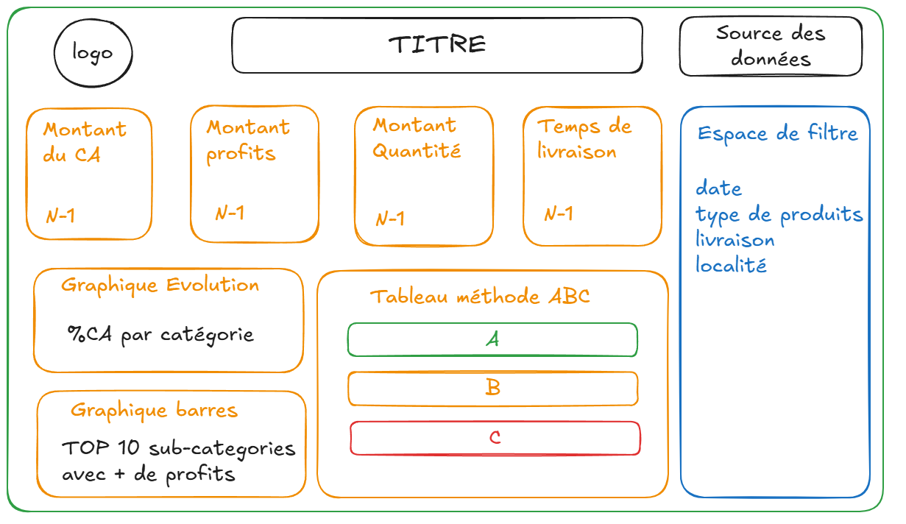
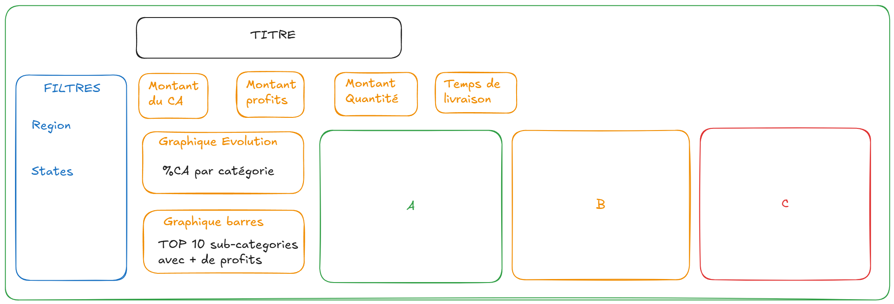

# `Fiche explicative du projet` : *Création d'un reporting Excel automatisé avec Python*
Automatisation d'un dashboard financier Excel dynamique. 

## Description du jeu de données
Le jeu de données est **SuperStore Dataset** contenant un registre simulé des ventes d'une entreprise aux États-Unis.

Le jeu de données contient 9 995 observations sur une temporalité de 2014 à 2017.

## Source des données
La source initiale du jeu de données provient du logiciel Tableau, mais les données ont été récupérées sur [Kaggle](https://www.kaggle.com/datasets/vivek468/superstore-dataset-final?resource=download).

## Dictionnaire des données

| Nom colonne  | Type          | Description |
| :--------------- |:----:| :----------------|
| Row ID  |   character        |  L'identifiant unique pour chaque ligne |
| Order ID | character | L'identifiant unique pour chaque commande |
| Order Date | date | La date au moment de l'achat |
| Ship Date | date | La date de livraison d'un produit |
| Ship Mode | character | Le mode de livraison spécifié par le client |
| Customer ID | character | L'identifiant unique pour identifier chaque client |
| Customer Name | character | Le nom et le prénom du client |
| Segment | character | Le type de client |
| Country | character | Le pays de résidence du client |
| City | character | Le ville de résidence du client |
| State | character | L'État de résidence du client |
| Postal Code | character | Le code postal du client |
| Region | character | Le point cardinal de résidence du client |
| Product ID | character | L'identifiant unique du produit |
| Category | character | La catégorie du produit acheté |
| Sub-Category | character | La sous-catégorie du produit acheté |
| Product Name | character | Le nom du produit acheté |
| Sales | float | Le montant de la vente du produit |
| Quantity | integer | La quantité de produit acheté |
| Discount | float | Le montant de la remise appliquée |
| Profit | float | Le montant du bénéfice ou de la perte généré par le produit |

## Objectifs du projet
L'objectif principal du projet est de créer automatiquement **un reporting sur Excel à partir de Python**. 

Nous allons devoir importer les données dans une feuille Excel et écrire des formules Excel via Python. Il faudra **varier les analyses et les designs** pour un rendu attractif. Le **filtrage** doit être possible pour préciser les résultats. Le visuel global doit avoir une **structure organisée** et logique. 

Concernant la structure du reporting, le schema ci-dessous représente un objectif du rendu. La partie haute sera réservée à des **éléments textuels de contexte** : le logo, un titre du rapport et la source des données. Ensuite, on doit avoir des **KPIs numériques** pour avoir une information rapide et direct. Plus bas, l'espace sera réservé à l'**affichage de graphiques**. Au centre, il faudrait pouvoir afficher un tableau appliquant la **méthode ABC** sur les données afin de voir les produits plus ou moins rentable. Enfin, sur la partie tout à droite, on doit pouvoir **filtrer les données** sur plusieurs aspects comme le lieu de vente, la date, les types de produits, etc.

**Voici le schema créé initialement avant le lancement du projet**


**Voici le schema du rendu final**


## Générer le rapport
#### Installation du projet
```bash
git clone https://github.com/Oscar-Cnam/projet_openpyxl_superstore.git
cd projet_openpyxl_superstore
uv sync
```

#### Lancer le code
```bash
uv run main.py
```

#### Récupérer le fichier
Le reporting au format .xlsx sera généré dans le dossier output/ sous le nom reporting.xlsx. Il est également disponible sur [MinIO](https://minio.lab.sspcloud.fr/oscar04/Superstore/reporting.xlsx).

## Architecture du projet
```text
projet_openpyxl_superstore/
├── components/             
│   ├── __init__.py
│   ├── charts.py           # Les graphiques
│   ├── filter.py           # Les filtres déroulants 
│   ├── indicators.py       # Les indicateurs numériques 
│   ├── styles.py           # Design des cellules  
│   └── tables.py           # Tableaux de données créés pour les indicateurs et les graphiques  
├── data/                   
│   ├── __init__.py
│   └── data.py             # Paramètres MinIO et création du fichier de données
├── notebooks/             
│   └── notebook.ipynb      # Notebook d'exploration  
├── output/              
│   └── reporting.xlsx      # Export du reporting
├── schemas_projet/         # Les schémas du projet
│   └── schema_initial.png  # Avant projet
│   └── schema_final.png    # Après projet
├── .gitignore             
├── main.py                 # Fichier de lancement du projet
├── pyproject.toml       
├── README.md             
└── uv.lock            
```
